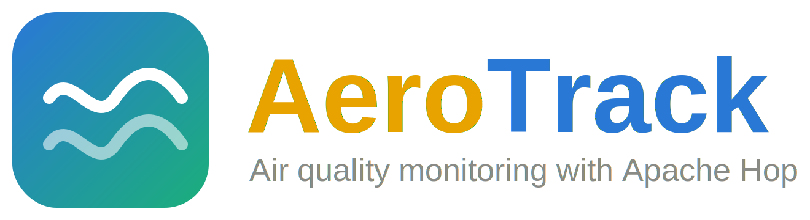

<p align="center">
  
</p>

<p align="center">
  Pipeline de ETL, banco de dados e dashboard de indicadores para monitoramento
  de qualidade do ar, construido com Apache Hop.
  <br />
  <em>
    Projeto academico | Capacitacao em IA e Transformacao Digital | Modulo 6
  </em>
</p>

---

<h2 align="center">Tecnologias utilizadas</h2>

<div align="center">
  
  
  
  
  
</div>

---

<h2 align="center">Descricao do projeto</h2>

O **AeroTrack** e uma solucao academica de integracao de dados que trata um dataset
publico de qualidade do ar, persiste os resultados em um banco de dados
relacional e apresenta indicadores em um dashboard.

O objetivo didatico e demonstrar o uso do Apache Hop para transformar dados
brutos em informacao estruturada: ingestao, tratamento de valores ausentes,
conversao de tipos, classificacao analitica, integracao com PostgreSQL,
orquestracao por workflow e consolidacao de indicadores.

Dataset publico &rarr; Tratamento &rarr; Regras de classificacao &rarr; Banco de dados &rarr; Consolidacao &rarr; Dashboard

---

<h2 align="center">Dataset e problema</h2>

| Item | Descricao |
| --- | --- |
| Dataset | [Air Quality](https://archive.ics.uci.edu/dataset/360/air+quality) (UCI Machine Learning Repository) |
| Origem | De Vito et al., estacao de monitoramento em uma cidade italiana, marco de 2004 a fevereiro de 2005 |
| Registros | 9357 leituras horarias, 15 variaveis (poluentes, sensores e condicoes ambientais) |
| Problema | Em quais periodos ocorreram as piores condicoes de qualidade do ar registradas, e quais variaveis ambientais (temperatura e umidade) estavam associadas a esses periodos? |

As faixas de classificacao (BOM, MODERADO, CRITICO) sao uma classificacao
analitica definida para este projeto a partir da distribuicao real do dataset,
sem referencia a uma norma regulatoria externa.

---

<h2 align="center">Arquitetura</h2>

```text
Dataset publico (UCI Air Quality)
  |
  +-- data/raw/AirQualityUCI.csv
        |
        +-- pl_01_ingestao_tratamento.hpl
        |     +-- ingestao, remocao de linhas vazias
        |     +-- tratamento do valor ausente -200
        |     +-- classificacao (nivel de CO, NO2 e turno)
        |     +-- separacao de leituras invalidas
        |     +-- carga em PostgreSQL (Insert/Update)
        |
        +-- PostgreSQL (leituras_qualidade_ar, leituras_rejeitadas)
              |
              +-- pl_02_consolidacao_indicadores.hpl
              |     +-- resumo_diario_qualidade_ar
              |     +-- resumo_mensal_qualidade_ar
              |
              +-- scripts/exportar_dashboard.sh
                    |
                    +-- dashboard/index.html (Chart.js)
```

As duas pipelines sao orquestradas pelo workflow
[`wf_orquestracao_qualidade_ar.hwf`](hop/workflows/wf_orquestracao_qualidade_ar.hwf).
A explicacao detalhada de cada etapa esta em
[docs/arquitetura.md](docs/arquitetura.md).

---

<h2 align="center">Estrutura do banco de dados</h2>

| Tabela / visao | Finalidade |
| --- | --- |
| `leituras_qualidade_ar` | Dados tratados e detalhados, uma linha por leitura horaria |
| `leituras_rejeitadas` | Leituras sem nenhum poluente de referencia (CO, NOx e NO2 ausentes) |
| `resumo_diario_qualidade_ar` | Indicadores agregados por dia |
| `resumo_mensal_qualidade_ar` | Indicadores agregados por mes, usados na evolucao temporal |
| `vw_indicadores_gerais` | Visao com os indicadores gerais do periodo, usada pelo dashboard |
| `vw_ranking_piores_dias` | Visao com os 10 dias de piores condicoes |

A chave unica em `data_hora` e a estrategia de Insert/Update garantem que uma
nova execucao do processo atualiza os registros existentes em vez de duplicar
linhas. O detalhamento das colunas esta em
[docs/contrato-banco.md](docs/contrato-banco.md).

---

<h2 align="center">Como executar</h2>

### Requisitos

- Docker Engine 24 ou superior e Docker Compose 2.20 ou superior
- Java 21 e [Apache Hop](https://hop.apache.org/) 2.18 ou superior instalados localmente
- Python 3.10 ou superior (para exportar o dashboard)

### Subir o banco de dados

```bash
cd database
docker compose up -d
```

### Registrar o projeto no Hop (uma unica vez)

```bash
hop-conf.sh -pc -p aerotrack -ph "$(pwd)/hop" -pf project-config.json -pkf
```

### Executar o processo completo

```bash
hop-run.sh -j aerotrack -f hop/workflows/wf_orquestracao_qualidade_ar.hwf -r local -l Basic
```

### Gerar o dashboard

```bash
scripts/exportar_dashboard.sh
cd dashboard && python3 -m http.server 8000
```

Acesse `http://localhost:8000` no navegador.

---

<h2 align="center">Indicadores calculados</h2>

| Indicador | Descricao |
| --- | --- |
| Leituras tratadas / rejeitadas | Volume processado e qualidade da carga |
| Percentual de horas em condicao critica | Proporcao de leituras classificadas como CRITICO em CO ou NO2 |
| CO e NO2 medios e maximos | Concentracoes medias e picos do periodo |
| Evolucao mensal de CO e NO2 | Tendencia ao longo dos 12 meses do dataset |
| Distribuicao por nivel (BOM, MODERADO, CRITICO) | Classificacao analitica das leituras |
| Leituras por turno do dia | Volume por madrugada, manha, tarde e noite |
| Ranking dos 10 piores dias | Dias com maior media de CO, usados para responder ao problema proposto |

---

<h2 align="center">Estrutura do projeto</h2>

```text
AeroTrack/
├── data/
│   └── raw/
│       └── AirQualityUCI.csv
├── hop/
│   ├── project-config.json
│   ├── metadata/
│   │   ├── rdbms/
│   │   ├── pipeline-run-configuration/
│   │   └── workflow-run-configuration/
│   ├── pipelines/
│   │   ├── pl_01_ingestao_tratamento.hpl
│   │   └── pl_02_consolidacao_indicadores.hpl
│   └── workflows/
│       └── wf_orquestracao_qualidade_ar.hwf
├── database/
│   ├── docker-compose.yml
│   └── init_aerotrack.sql
├── dashboard/
│   ├── index.html
│   ├── data/indicadores.json
│   └── vendor/chart.umd.min.js
├── scripts/
│   └── exportar_dashboard.sh
├── docs/
│   ├── assets/
│   ├── evidencias/
│   │   ├── capturas/
│   │   ├── logs/
│   │   ├── relatorio-desenvolvimento-aerotrack.pdf
│   │   ├── relatorio-desenvolvimento-aerotrack.tex
│   │   ├── AeroTrack-Apresentacao-Modulo6.pptx
│   │   └── AeroTrack-Apresentacao-Modulo6.pdf
│   ├── arquitetura.md
│   ├── contrato-banco.md
│   ├── evidencias-testes.md
│   ├── registro-ajustes.md
│   ├── contribuicoes.md
│   └── fluxo-git.md
└── README.md
```

---

<h2 align="center">Testes e evidencias</h2>

O roteiro inclui a execucao do workflow do zero, a conferencia das contagens no
banco, a reexecucao para validar a ausencia de duplicidades e a geracao do
dashboard.

| Documento | Conteudo |
| --- | --- |
| [Evidencias e testes](docs/evidencias-testes.md) | Cenarios, resultados esperados e nomes das capturas |
| [Relatorio de desenvolvimento](docs/evidencias/relatorio-desenvolvimento-aerotrack.pdf) | Arquitetura, pipelines, tratamento, banco, indicadores e validacao |
| [Apresentacao](docs/evidencias/AeroTrack-Apresentacao-Modulo6.pdf) | Slides para a apresentacao de 10 minutos |
| [Registro de ajustes](docs/registro-ajustes.md) | Decisoes tecnicas e ajustes feitos durante o desenvolvimento |
| [Plano de contribuicoes](docs/contribuicoes.md) | Divisao de responsabilidades da equipe |
| [Fluxo Git](docs/fluxo-git.md) | Regras de branches, commits e MRs |

---

<h2 align="center">Reexecucao e controle de duplicidade</h2>

Se o workflow for executado novamente com a mesma fonte de dados, a pipeline de
carga usa **Insert/Update** com chave em `data_hora`: registros existentes sao
atualizados e nenhuma linha e duplicada. A tabela de resumo diario e mensal
segue a mesma logica, com chave em `data_referencia` e em `(ano, mes)`. A
tabela de rejeitados e recarregada por completo a cada execucao, pois funciona
como um log da ultima carga.

---

<h2 align="center">Limitacoes</h2>

- Os dados sao apagados quando o container do PostgreSQL e removido junto com
  o volume associado.
- As leituras rejeitadas nao carregam data, pois a linha de origem nao possui
  nenhum valor de poluente para derivar o periodo; o total e reportado de
  forma agregada.
- A solucao foi projetada para fins didaticos e execucao em uma unica
  instancia local.

---

<h2 align="center">Equipe</h2>

| Integrante | GitHub | Contribuicao |
| --- | --- | --- |
| Juliana Ballin Lima | [@JulianaBallin](https://github.com/JulianaBallin) | Estrutura do projeto Hop, pipelines de ingestao e consolidacao, banco de dados, workflow, dashboard e documentacao |
| Allef Oliveira Ramos | [@allef-oliveira](https://github.com/allef-oliveira) | Regras de classificacao, revisao dos indicadores e do dashboard |
| Fernanda de Oliveira da Costa | [@nanda-costa](https://github.com/nanda-costa) | Validacao do tratamento de dados e do contrato do banco |
| Pedro Henrique Oliveira Dias | [@pedroddias-oss](https://github.com/pedroddias-oss) | Testes de reexecucao, evidencias e apresentacao final |

O detalhamento completo esta em [docs/contribuicoes.md](docs/contribuicoes.md).

---

<h3 align="center">AeroTrack | Monitoramento de Qualidade do Ar | Apache Hop | Modulo 6</h3>
